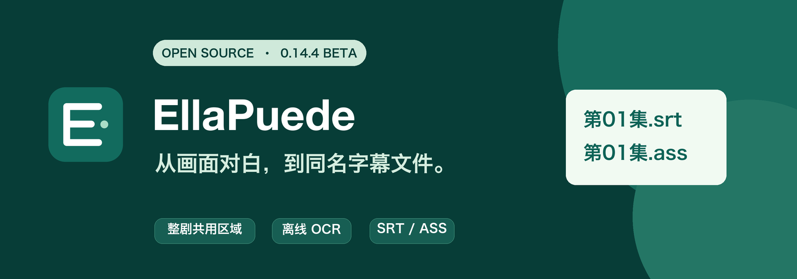

# EllaPuede 字幕提取工具

**从视频画面提取已经烧录的对白字幕，按原视频文件名导出 SRT / ASS。**

[下载安装包](https://github.com/joesun16/ellapuede-subtitle-studio/releases/latest) · [使用指南](docs/USER-GUIDE.md) · [命令行与集成](docs/CLI.md) · [已知限制](docs/QUALITY.md) · [English](#english)

> **0.14.4 公测版。** Mac Apple Silicon 与 Windows x64 使用同一版源码，安装包内置运行时与 OCR 模型。安装后处理视频无需联网。现阶段不承诺“100 分钟视频 5–10 分钟完成”或任何语言的零错误识别。

## 它解决什么问题

视频画面里已经有字幕，但没有可编辑的字幕文件时，逐条截图、抄写、对轴很费时。EllaPuede 让你导入单集或整剧文件夹，在视频上**框选对白字幕区域**，选择原字幕语言及导出格式，随后批量识别并自动导出：

```text
第01集.mp4  →  第01集.srt
第02集.mp4  →  第02集.srt
```

你也可以选择 ASS 或同时导出两种格式。同一部剧默认共用一次框选的区域，单集可单独调整。自动定位是可主动选择的备选项；工具不会默认收集整个画面的招牌、水印或其他文字。

## 下载安装

在 [GitHub Releases](https://github.com/joesun16/ellapuede-subtitle-studio/releases/latest) 获取：

| 系统 | 文件 | 安装方式 |
|---|---|---|
| Windows x64 | `EllaPuede-0.14.4-Windows-x64-Setup.exe` | 运行安装向导 |
| macOS Apple Silicon | `EllaPuede-0.14.4-macOS-AppleSilicon.dmg` | 将 App 拖入“应用程序” |
| macOS Apple Silicon | `EllaPuede-0.14.4-macOS-AppleSilicon-Installer.pkg` | 使用安装向导 |

本版安装包尚无公司代码签名；Mac 版尚未完成 Apple 公证，Windows 版也可能显示发布者验证提示。详情见 [安装说明](docs/INSTALLATION.md)。Intel Mac 和 Windows ARM 原生安装包尚未提供。

## 主要能力

- **整剧批量处理：** 文件夹导入、自然集数顺序、一次框选共用、项目总进度、暂停与继续。
- **专注对白：** 仅从选定画面区域读取已有文字，不做音频转写、翻译或剧情补写。
- **多语言离线 OCR：** 可手选英语、简繁中文、中英双语、日语、韩语、泰语及西/法/德/葡/意语。自动语言判断目前主要覆盖中、英、韩；泰语请手选。
- **直接导出：** 同视频名 UTF-8 SRT、标准 ASS，完成后无需在工具里校对才能导出；已完成任务支持重导出和重新处理。
- **资源模式：** 三档模式调整本机并行和内存预算，不改变对白识别范围或质量规则。

## 准确率与速度边界

OCR 会受字幕字号、描边、压制质量和画面遮挡影响。本版针对连续字幕因逐帧 OCR 波动被拆开的情况增加跨语种时间聚合，并在当前画面上复核可疑读数。Mac 15 及更高系统的泰语自动后端改用系统 Vision；旧系统和 Windows 继续使用内置离线泰语模型。不同平台的后端不同，真实文字仍可能错读或漏读。

一次 Mac 源码版泰语实测中，148.821 秒视频从空缓存处理耗时 **109.82 秒**、峰值进程树内存约 **1.09 GB**；旧版同片约 400 秒，识别后端也从 RapidOCR 变为 Vision。输出碎片减少，但仍有短时重复和错漏，不能据此宣称字符准确率提高，更不能外推到 Windows 或百分钟视频。记录和验收边界见 [质量与性能](docs/QUALITY.md)。欢迎提交可复现的合成样本和问题报告。

## 从源码运行

需要 Python 3.13。源码构建时会按 SHA-256 下载固定版本的开源 OCR 模型；最终用户安装包已内置模型。

```bash
python -m pip install -r requirements-desktop.txt pyinstaller==6.17.0
python -m unittest discover -s tests -t . -p 'test_*.py'
python launch.py
```

桌面打包与 Windows 本地构建见 [构建说明](docs/BUILD.md)。其他程序可通过 [命令行与 JSON 事件](docs/CLI.md) 调用，不应直接依赖内部 `src` 模块。

## 参与和许可

欢迎通过 [Issues](https://github.com/joesun16/ellapuede-subtitle-studio/issues) 报告问题，通过 Pull Request 贡献代码。提交前请阅读 [贡献指南](CONTRIBUTING.md) 和 [安全说明](SECURITY.md)。**不要上传无权公开的剧集视频、对白或私人路径。**

本项目自有源码以 [MIT License](LICENSE) 发布；内置的 Qt、RapidOCR、OCR 模型、PyAV/FFmpeg 等各自遵循其原有许可，见 [第三方组件与模型来源](THIRD_PARTY_NOTICES.md)。开源许可不授予 EllaPuede 名称与标志的商标使用权，见 [品牌说明](TRADEMARKS.md)。

## English

EllaPuede extracts **existing burned-in dialogue subtitles from video frames** and exports same-basename SRT/ASS files. Select the subtitle region once for a series, choose the source language and output format, then process episodes offline in a batch. It is not speech-to-text, translation, or a promise of error-free OCR. Version 0.14.4 is a beta for macOS Apple Silicon and Windows x64. See the [release](https://github.com/joesun16/ellapuede-subtitle-studio/releases/latest), [user guide](docs/USER-GUIDE.md), and [quality limits](docs/QUALITY.md).
